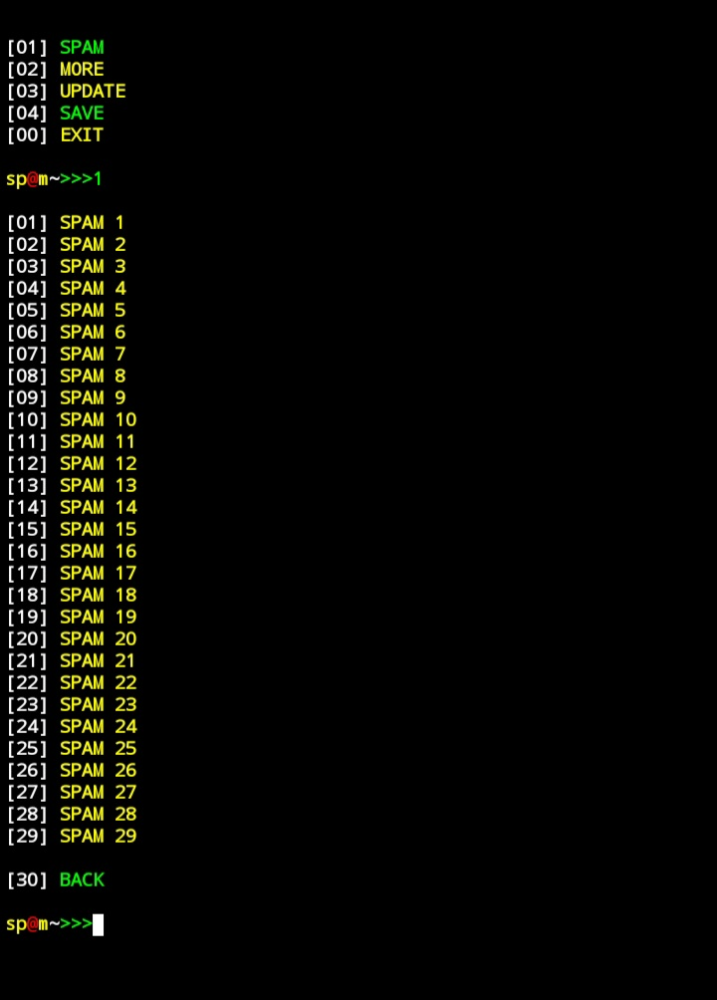

## SPAM

## AVAILABLE ON :
 
   * `Termux`

## TESTED ON :

   * `Termux`

## REQUIREMENTS :

   * `storage 500MB`
   * `python`
   * `git`
   * `ruby`
   * `figlet`
   * `lolcat`
   * `internet`

## INSTALLATION TERMUX :

   `apt update && apt upgrade -y`
   `apt install git python -y`
   `git clone https://github.com/DilumBBandara/SPAM.git`
   `cd SPAM`
   `bash bashup.sh`
   `python spam.py`

## SCREEN SHOTS :

